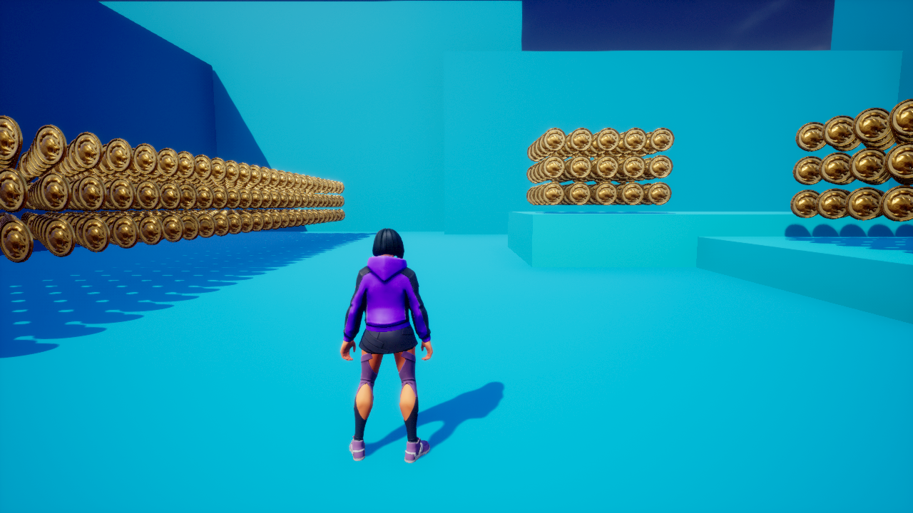

# CC-Collectables

> Community Content for efficient collectable objects!

## Overview

It's common in games to want to have lots of items that can be picked up by players.  Unfortunately, the
obvious approach (each collectable as an individual netowrked object) can lead to severe performance
problems, if there are large number of collectable objects.

This community content is intended to get around that problem.

## Implementation Details

This content contains code and structure to allow most of the pickup logic to happen on the client side.
The client still reports picked up objects to the server, and the server still validates it, (so that
two clients can't pick up the same object, for example) but the network traffic is reduced tremendously.

The library is built around the idea of "collectable groups".  A collectable group is a collection of
collectables in the heirarchy that are treated as a unit.  They are loosely tracked by the server, but
only for keeping them in sync between clients and resolving conflicts.  (Like when two players try to
grab the same collectable at the same time.)

Collectables in a group will batch and share update messages with the server.  Collision is handled
entirely client-side, and the collectable group sends periodic updates to the server whenever the
local player collects any items.

By default, it will send no more than one message every few seconds.  These messages are compressed,
and contain a list of all of the things this player has collected since the last update.

Each collectable group also contains an object with a custom networked property, which is how the
server sends updates back to the groups.  (And how people joining the game late receive the current
state of all the collectable objects in the game.)

Since each collectable group contains only one networked object (the client context containing all
of the collectables) it is very efficient on netowrk usage.

## Quick Start

Want to have collectable objects in your game?  Cool.  Grab the Collectable Coin Group template
or the Harvestable Tree Patch template, and put some in the world!

You are good to go!  You can now run and jump around and grab them, and track the "Coins" and "Leaves"
resources on the player to see how many they have colleted.

If you want to customize the collectable objects, and replace them with something of your own,
just deinstance the templates, and put new objects in the ClientContext to collect!  You'll need
to make sure every object has a custom property named `Trigger` pointing to that object's trigger
volume.  Look at the sample templates if you need a reference!

## Extra Details

Here are some extra details about the structure.  You shouldn't need to know this if you are just
using/modifying existing collection groups, but this is the sort of stuff you will want to
know about if you are creating your own collection groups from scratch.

### Group size

In the sample, the coin groups have 75 (5x5x3) coins per group.  This isn't a hard limit though-
collection groups can have an arbitrary number of items in them.  Pick whatever seems right for your
use case.  

Collection groups batch their updates, so putting too few items in a group can lose that benefit.
(The extreme case would be having only one item per collection group, which would just end up being
effectively a networked object that updated more slowly than normal.)

Collection groups also always update with their full contents, so having large collection groups
means that the actual update messages become large and potentially slower.  So the other extreme
would be putting several thousand items into the same collection group, dramatically slowing down
the update time.

### Structure

Collection groups follow a fairly specific structure:

At the top level there is the collectable group.  There are a few optional properties that can be placed
on this object, to control the behavior of all collectables in the group.

* `Resource` (string) - If this field exists, this is the name of the resource that will be awarded to the player (via `Player.AddResource()`)
  whenever they pick up a collectable in this group.  (If this property does not exist, then no resources will be awarded.)
* `ResourceAmount` (integer) - This is how many of a resource to give the player when a resource is collected.  If this property does
  not exist, then it will default to 1.
* `PickupEffect` (AssetReference) - This property contains an asset reference to a template that will spawn whenever the player picks up
  a collectable from this group.  If undefined, no effects will spawn.  Use this to make sparkles, sound effects, etc, whenever things
  are collected.

Each of these properties only applies to items in its collection group.  (But it does apply to *every item* in the group!)  If you want to mix
and match (i. e. have some coins that give one gold, and some coins that give 5 gold, and have a sparklier pickup effect) then
just make two separate collectable groups, one for each.

Inside the collectable group, there should be the script, `CollectableGroup_Server`, and a (networked) ClientContext
containing all of the actual collectable items, as well as the script `CollectableGroup_Client`  The Client Context
also needs to have a networked custom property named `Contents` - this is the main channel by which the server
communicates information to the client.

Both the `CollectableGroup_Server` and the `CollectableGroup_Client` scripts have a custom property, `ClientRoot`,
which should point to the client context.

Inside the client context, (in addition to the `CollectableGroup_Client` script) should be all of the actual items
that are to be collected.

These can be structured however you want - they just need to have a trigger volume somewhere inside of them, and a
top-level property named `Trigger`, linking to it.
